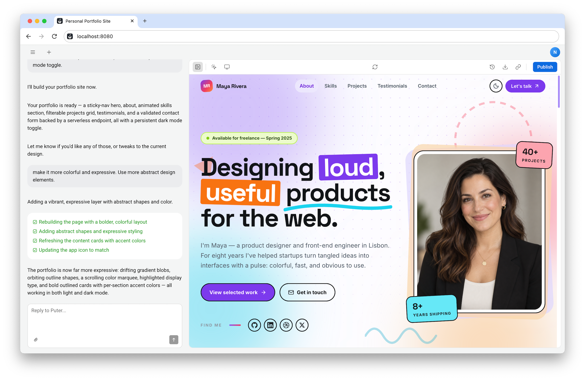

<h3 align="center"></h3>
<h3 align="center">AI Builder For Creating Sites and Apps!</h3>

<p align="center">
    <a href="https://builder.puter.com/"><strong>« LIVE DEMO »</strong></a>
    <br />
    <br />
    <a href="https://builder.puter.com">Official Site</a>
    ·
    <a href="https://puter.com">Puter.com</a>
    ·
    <a href="https://developer.puter.com/">Developers</a>
    ·
    <a href="https://twitter.com/HeyPuter">X</a>
</p>

<h3 align="center"></h3>

<br>

## AI Builder

Use AI to build websites and applications without writing any code. An open-source alternative to Lovable, Replit, v0, and similar platforms, AI Builder is licensed under the Apache License 2.0 to ensure freedom and flexibility for developers. Fork it, customize it, and make it your own!

AI Builder uses <a href="https://developer.puter.com/">Puter.js</a> to provide everything your projects might need; from authentication, storage, and database to serverless functions, hosting, and real-time capabilities, all seamlessly integrated without requiring any additional setup.

<br>

## Features

Go from an idea to a working website or application in your browser. AI Builder brings creation, editing, and publishing together in one place.

- **Build with AI:** Describe what you want in plain language and turn it into a website or application, without coding or any technical knowledge.
- **Secure and scalable apps:** Built on <a href="https://github.com/HeyPuter/puter">Puter's Open-source Internet OS</a> technology, your apps will run securely and scale effortlessly without requiring you to manage infrastructure or API keys.
- **Batteries included:** Authentication, storage, databases, AI, networking, realtime capabilities, and serverless functions, all handled seamlessly by Puter.js.
- **Publish and share:** Publish your project to a public URL when you're ready to share it with the world.
- **Live preview:** See your project take shape and try it out as you make changes.
- **Chat and visual editing:** Ask for changes in chat or select an element in the preview to tell the AI exactly what to update.
- **Version history:** Revisit saved versions and restore an earlier state as you experiment with your project.

Follow the steps below to start building your first website or app.

<br>

## Getting Started

### 💻 Installation

```bash
git clone https://github.com/HeyPuter/builder
cd builder
npm install
npm run dev
```

<br>

### 🌐 Live Demo

Check out the live demo of AI Builder at [https://builder.puter.com/](https://builder.puter.com/).

<br>


## Support

Connect with the maintainers and community through these channels:

- Bug report or feature request? Please [open an issue](https://github.com/HeyPuter/builder/issues/new/choose).
- X (Twitter): [x.com/HeyPuter](https://x.com/HeyPuter)
- Security issues or abuse reports? [security@puter.com](mailto:security@puter.com)
- Email maintainers at [hi@puter.com](mailto:hi@puter.com)

We are always happy to help you with any questions you may have. Don't hesitate to ask!

<br/>

## License

This repository, including all its contents, sub-projects, modules, and components, is licensed under [Apache License 2.0](LICENSE) unless explicitly stated otherwise. Bundled third-party libraries and fonts retain their own licenses; see [Third-party notices](THIRD_PARTY_NOTICES.md).

<br/>
